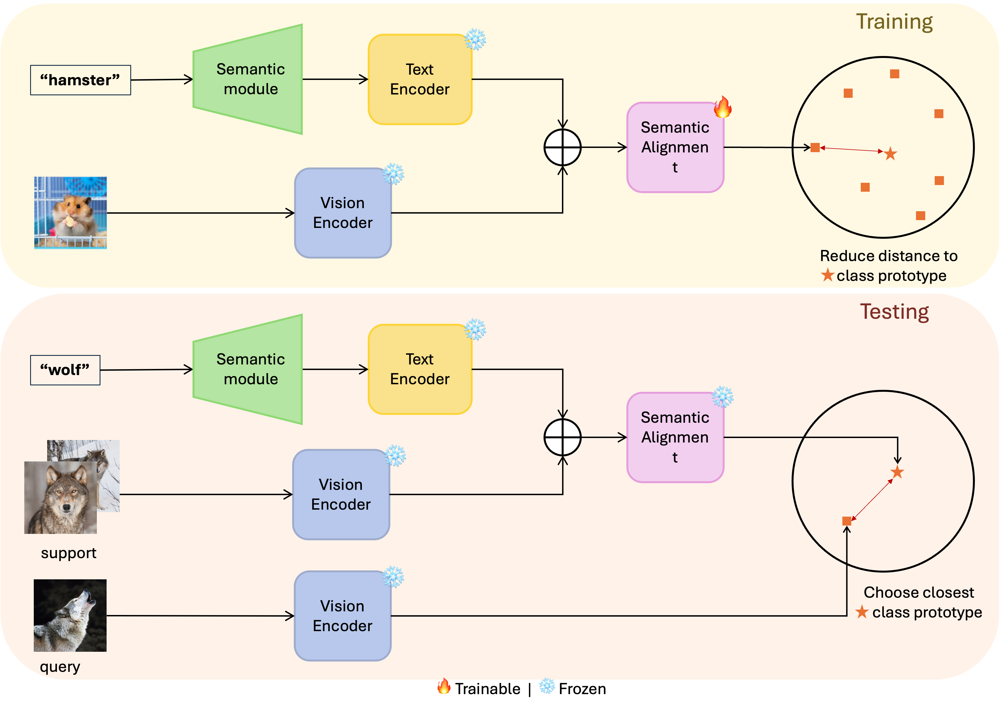
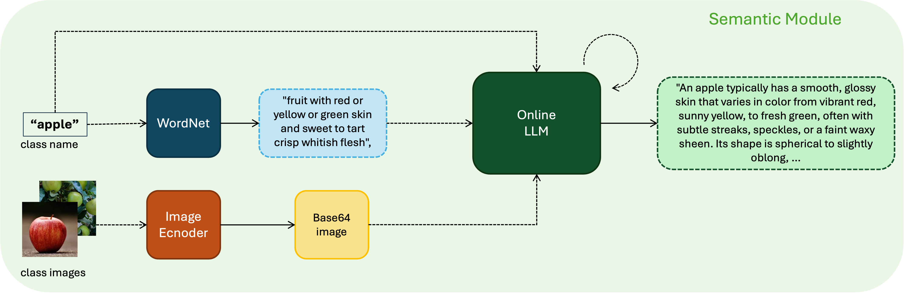

# Enhancing Few-Shot Learning with Large Language Models


The whole repository, until 30.6.2025, is the result of a final Master's Thesis of the [Master's Degree in Data Science](https://mat.ub.edu/sciencedata/) supervised by Petia Radeva, PhD. The [Master's Thesis report](https://github.com/jdieguvi15/TFM-SemFew/blob/main/report.pdf) is published in this repository in a PDF. Any contribution or idea to continue the lines of the proposed work will be very welcome.

# Abstract:

Recently, Few-Shot Learning has gained significant momentum in the machine learning community. This field focuses on enabling models to learn from extremely limited data, often just a handful of examples per class. Unlike traditional deep learning, which relies on large-scale datasets, few-shot learning requires novel, efficient strategies that challenge conventional assumptions and fundamentally shift the paradigm toward "learning to learn", for faster, more adaptable models.

In this work, we explore the most common approaches to few-shot learning and introduce our own method. Building upon the SemFew framework, we propose a metric-based meta-learning approach using Prototypical Networks, enhanced with a semantic support module. This module uses class descriptions from WordNet, refined through a Large Language Model, to provide high-quality semantic embed- dings that guide the model in understanding novel classes. Our proposed model is remarkably simple yet highly effective, achieving competitive performance with state-of-the-art methods, specially in 1-shot scenarios (only one example per class). 

We validate our method across three widely used few-shot classification benchmarks: CIFAR-FS, FC100, and MiniImageNet. The results consistently demonstrate the effectiveness of incorporating semantic guidance to face unseen classes. Further- more, we present an in-depth study of modern LLMs, evaluating their performance across different prompting strategies, and investigating multiple sources of data for generating the best semantic representations. This analysis offers valuable insights into how semantic guidance can be optimized for few-shot learning.

Overall, this work demonstrates the power of combining simple metric-based learning with rich semantic embeddings, offering a practical and competitive alternative to more complex architectures while encouraging new directions for future research in few-shot learning.


# Method
**Semantic Evolution**

<div style="background-color: white; display: inline-block; padding: 5px;">
  
</div>

**Overall framework**

<div style="background-color: white; display: inline-block; padding: 5px;">
  
</div>

# Few-shot Learning Results
|  Dataset  | 1-Shot 5-Way | 5-Shot 5-Way |  
|:--------:|:------------:|:------------:|
| CIFAR-FS |    84.91 ± 0.69     |    89.36 ± 0.59    |
|  FC100  |     52.68 ± 0.79     |    62.76 ± 0.78    |
| MiniImageNet |    75.02 ± 0.69     |    82.72 ± 0.79    |

# Distribition of the respository
- **Model**. Contains the code for the model created. It's a meta-learning metric-based Prototype Network approach that uses semantic aid to guide understand new classes.
- **Notebooks**: collection of tests that have been carried out during the development with very interesting results.
- **Descriptions**: Folder containing jsons with many different description collections that have been used to aid the model.
- **Imgs**: informative graphics.
- **Results**: folder with some classification results. These are NOT the results of the model, it's from other tests.

## Notebooks

- [Example on how to run the code](https://github.com/jdieguvi15/TFM-SemFew/blob/main/notebooks/local_runs.ipynb)
- [Study on the class 'baby'](https://github.com/jdieguvi15/TFM-SemFew/blob/main/notebooks/study_babies.ipynb)
- [Generation of semantics](https://github.com/jdieguvi15/TFM-SemFew/blob/main/notebooks/semantic_key.ipynb)
- [kaggle runs](https://github.com/jdieguvi15/TFM-SemFew/blob/main/notebooks/kaggle_notebook.ipynb)


# Prerequisites

The following prerequisites are required to run the scripts:

- [PyTorch and torchvision](https://pytorch.org)

- Dataset: Please download the dataset from [Google Cloud](https://drive.google.com/drive/folders/1elbJ6aHxtKGutzOxlXA7QwV45EZEqNxq?usp=drive_link) and modify the corresponding dataset path in the training file.

- Pre-trained weights: Please download checkpoints from [Google Cloud](https://drive.google.com/drive/folders/1J419EwA7gOKsXhmImKg_I-HvscyqLpBB?usp=sharing), then put them into ./checkpoints directory.

- Install packages
```python
pip instal -r requirements.txt
```


# Contact  

Feel free to contact me to discuss any issues, questions or comments.

* GitHub: [jdieguvi15](https://github.com/jdieguvi15)
* Mail: joeldvd.jd@gmail.com

### BibTex reference format for citation for the Code
```
@misc{joelTFMcode,
title={Enhancing Few-Shot Learning with Large Language Models},
url={https://github.com/jdieguvi15/TFM-SemFew.git},
note={GitHub repository.},
author={Joel Dieguez},
year={2025}
}
```
### BibTex reference format for citation for the report of the Master's Thesis

```
@misc{joelTFM,
title={Enhancing Few-Shot Learning with Large Language Models},
url={https://github.com/jdieguvi15/TFM-SemFew/blob/main/report.pdf},
note={Report of the Master's Thesis.},
author={Joel Dieguez},
year={2025}
}
```
